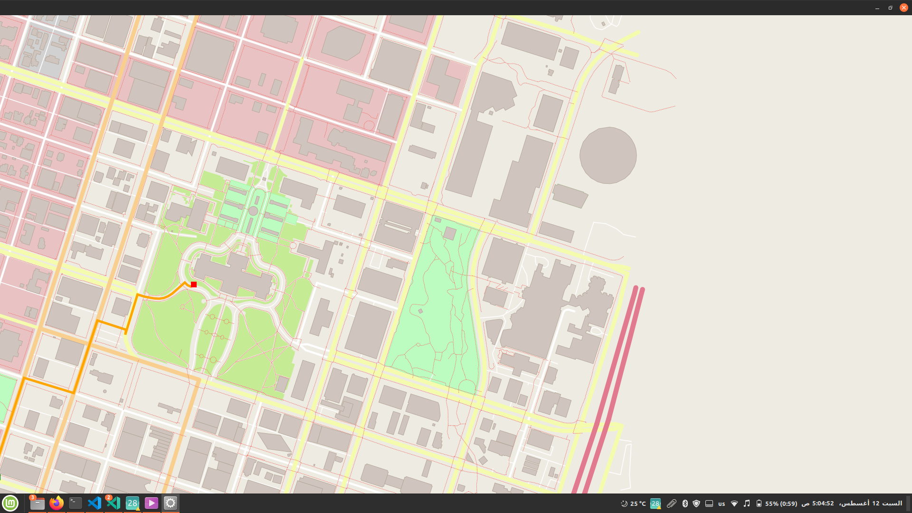

# C++ ND Route Planning Project
This is the first milestone project of the C++ Nanodegree program. The project is based on the IO2D library and the OpenStreetMap data. The project is a route planner that finds the shortest path between two points on a map.

## How to run the project
On linux, run the [CppND-Route-Planning-Project](Udacity_Cpp_nanodegree/CppND-Route-Planning-Project/bin/CppND-Route-Planning-Project) executable file that is located in the bin folder of the project. The executable file is compiled with the IO2D library and the OpenStreetMap data. The executable file takes the start and end coordinates of the map as input and outputs the shortest path between the two points. To run the executable file, open a terminal and navigate to the bin folder of the project. Then run the following command:
```
./CppND-Route-Planning-Project -f ../map.osm
```
the following output will be displayed and you will be asked to enter the start and end coordinates of the map as shown below I have entered the start and end coordinates of the map as (0,0) and (40,40) respectively:
```
Reading OpenStreetMap data from the following file: ../map.osm
Enter start x between 0 and 100
0
Enter start y between 0 and 100
0
Enter end x between 0 and 100
40
Enter end y between 0 and 100
40
The distance = 454.843meters.
```
NOTE: the total distance is displayed in meters in the last line.

The following window will be displayed showing the shortest path between the two points:


## How to build the project
To build the project, go to this markdown file [README2.md](Udacity_Cpp_nanodegree/CppND-Route-Planning-Project/README2.md)