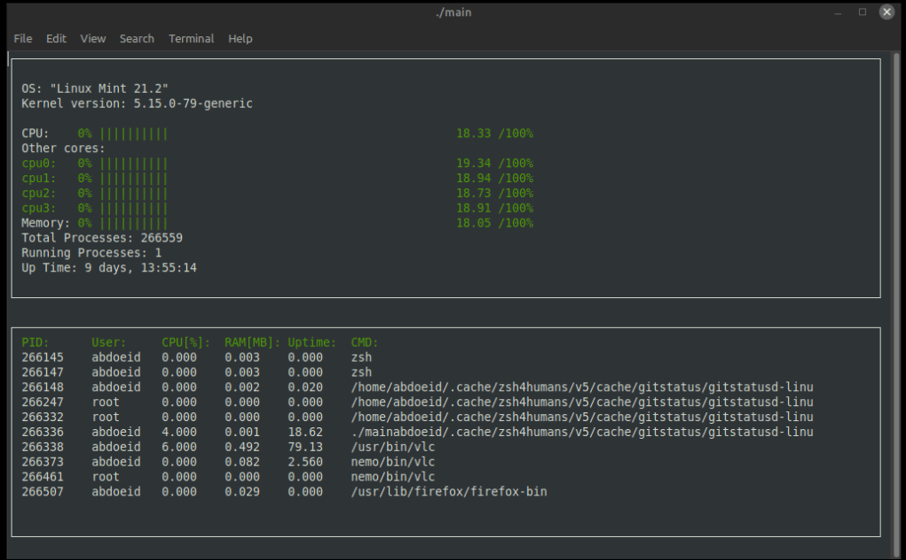

# C++ ND System Monitor Project
This is the second milestone project of the C++ Nanodegree program. It is simply the Windows `task manager` but for linux. The project is based on the ncurses library and the Linux system data. The project is a system monitor that displays the CPU utilization, memory utilization, and the running processes on the system in a terminal window. It also displays the total running time of the system and the running time of each process and can be further extended to display more system data.

## How to run the project
On linux mint or any linux distribution that is based on Ubuntu
1. Clone the project repository: `git clone repo-link`
2. Navigate to the project directory
3. Create a build directory and navigate to it:
`md build`
4. Run cmake and make
```
cmake ..
make
```
5. Run the executable file by navigating to the bin directory
from within the terminal: `./bin/SystemMonitor`
