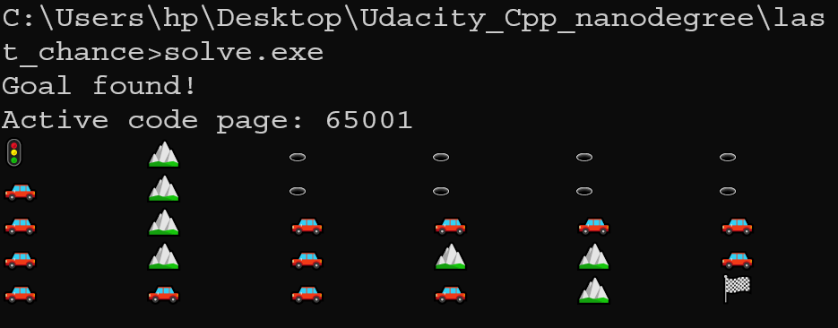

# Path finder using A* algorithm
The maze is located in the file `1.board` and it is a rectangular shape of any dimensions. It is filled with `0` and `1` where `0` is a free space and `1` is a wall. The maze has only one entrance and one exit. The entrance is located at the top left corner and the exit is located at the bottom right corner [by default and they can be modified in the main function]. The program finds the shortest path from the entrance to the exit. The path is marked with `🚗`, the entrance is marked with `🚦`, the non-visited cells are marked with `🕳`, the obstacles are marked with `⛰️` and the goal cell is marked with `🏁`. 

## How to run the program
Simply run the file `solve.exe` on Windows after putting your maze in the file `1.board`. The program will solve it and print the solution in the terminal after setting up the UTF-8 encoding to properly display the signs.

## Example
The following maze is located in the file `1.board`:
```
0, 1, 0, 0, 0, 0,
0, 1, 0, 0, 0, 0,
0, 1, 0, 0, 0, 0,
0, 1, 0, 1, 1, 0,
0, 0, 0, 0, 1, 0,
```
Our start is (0, 0) and our goal is (4, 5). The program will print the following solution:
 